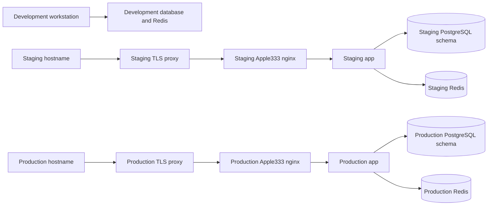

# Phase 01 environment architecture

## Purpose and source of truth

Apple333 has three isolated operating environments: development, staging, and
production. They must never share a PostgreSQL schema, Redis instance, secrets,
Compose project name, persistent volume, or deployment state marker.

The canonical managed-server contract is the repository's
[`deploy/`](../../deploy/README.md) bundle. Its ownership checks and safety
policy take precedence over ad-hoc Docker commands. This document describes the
required architecture; it does not claim that a particular server has been
provisioned or validated.

## Environment contract

| Environment | Intended use | Data rule | Deployment rule |
| --- | --- | --- | --- |
| Development | Local feature work and automated tests | Disposable, synthetic data only | Local `pnpm` and the root `docker-compose.yml` may be used for local dependencies. |
| Staging | Release rehearsal and integration verification | Isolated, non-production data; no customer data unless formally approved | Use a separate hostname, secrets, Compose project, state path, database, schema, and volumes. |
| Production | Customer-facing workload | Dedicated production data only | Use the reviewed `deploy/` workflow and an explicit migration decision. Never auto-deploy from a branch. |

## Server baseline

The production host should be a supported Linux distribution with Docker Engine
and Docker Compose v2. The deployment scripts additionally require `bash`,
`realpath`, `openssl`, `flock`, `curl`, and standard GNU tools.

Capacity must be sized from measured traffic and database volume, not guessed
from the repository. Until capacity testing exists, provision at least two vCPU,
4 GiB RAM, and sufficient encrypted disk for the application images, PostgreSQL
data, Redis persistence, and retained backups; treat that as a starting point,
not a production capacity guarantee. Put the checkout and deployment state on
separate paths such as `/opt/apple333` and `/var/lib/apple333`.

Before go-live, document the actual host size, storage class, backup capacity,
operator account, patching owner, and escalation contact in the release record.

## Network and port model

| Boundary | Protocol / port | Exposure | Rule |
| --- | --- | --- | --- |
| Internet to TLS edge | HTTPS/443; HTTP/80 only for redirect or ACME | Public | Terminate TLS at an organization-managed proxy or load balancer. |
| TLS edge to bundled nginx | HTTP to `127.0.0.1:8080` by default | Loopback only | The `deploy/compose.production.yml` nginx container is intentionally loopback-bound. |
| Bundled nginx to Next.js app | HTTP/3000 | Private Docker network | App is exposed only to nginx. |
| App to approved external integrations | HTTPS via app-only egress Docker network | Outbound only | Host firewall or an egress proxy must restrict destinations; no inbound port is published on this network. |
| App to PostgreSQL | TCP/5432 | Private Docker network | Never publish PostgreSQL to the host or internet. |
| App to Redis | TCP/6379 | Private Docker network | Never publish Redis to the host or internet. |
| Operator access | SSH/22 or approved equivalent | Restricted administrative network | Use named accounts, MFA, least privilege, and an allowlist/VPN where available. |

The deployment scripts detect an occupied configured HTTP port and stop. They
must not kill an unknown process to free a port.

## Services and data boundaries

| Service | Current repository contract | Boundary |
| --- | --- | --- |
| Next.js application | Production image uses Next standalone output, a non-root runtime user, and `/api/health` liveness plus `/api/ready` dependency readiness. | No direct public container port; it alone joins the private and controlled-egress networks. |
| Prisma migration task | A separate non-root, one-shot image contains only the Prisma CLI and reviewed migration bundle from the same release checkout. | It is profile-gated and runs only through managed install/update commands after build; it has no public port. |
| nginx | Bundled reverse proxy on the private Docker network; published only to configured loopback bind. | TLS remains the responsibility of the outer approved proxy/load balancer. |
| PostgreSQL 16 | Managed internal container in `deploy/compose.production.yml`. | Dedicated Apple333 database and non-`public` schema are required by deployment validation. |
| Redis 7 | Managed private container with authenticated persistence; `/api/ready` issues a real `PING`. | Never publish it to the host; staging evidence remains required. |
| Object storage / MinIO | Isolated private MinIO service with labelled persistent volume and health check. | The app intentionally retains `UnconfiguredStorage` until a separately reviewed S3 adapter/bucket/user plan is approved. |
| Observability | Sentry client/server/edge initialization, opt-in private Prometheus metrics, alert rules, and Grafana provisioning are versioned. | DSN, alert receivers, log collection, dashboard coverage, and staging evidence remain required. |

## Environment variables

Never commit real environment files. `deploy/.env.production.example` is the
non-secret production template; `.env.example` is development-oriented and is
not a production template.

| Category | Required variables | Handling rule |
| --- | --- | --- |
| Identity | `APPLE333_PROJECT_ID`, `APPLE333_ENVIRONMENT`, `COMPOSE_PROJECT_NAME`, `APPLE333_INSTALL_ROOT`, `APPLE333_STATE_DIR`, `APPLE333_BACKUP_DIR`, `APPLE333_INSTALL_ID` | These identify ownership. Do not change them in place for an existing environment. |
| Application origin | `NODE_ENV`, `APP_NAME`, `APP_URL`, `AUTH_URL`, `NEXTAUTH_URL` | Production public origins must use HTTPS. |
| Authentication | `AUTH_SECRET`, `NEXTAUTH_SECRET` | Unique random secrets of at least 32 characters; store only in the approved secret manager and protected server environment file. |
| Database | `POSTGRES_DB`, `POSTGRES_SCHEMA`, `POSTGRES_USER`, `POSTGRES_PASSWORD`, `DATABASE_URL` | Use a dedicated database/schema. `DATABASE_URL` in the canonical bundle must target the managed `postgres` service. |
| Cache | `REDIS_URL`, `REDIS_PASSWORD` | Keep internal; use the authenticated managed Redis URL only. |
| Infrastructure | `MINIO_ROOT_*`, `PROMETHEUS_RETENTION_TIME`, `GRAFANA_*` | Keep MinIO/observability access private; use distinct strong secrets. |
| Backup | `APPLE333_BACKUP_AGE_*`, `APPLE333_BACKUP_OFFSITE_DIR`, `APPLE333_BACKUP_RETENTION_DAYS` | Required before encrypted migration/purge backups or scheduled backup jobs. A second path alone is not proof of off-host/offsite storage; record independent failure-domain evidence. |
| Optional services | `SENTRY_DSN`, `S3_*` | Set only after the provider, data classification, access policy, and recovery requirements are reviewed. |

## Security boundaries and release gates

1. A developer workstation cannot access production secrets or production
   database credentials by default.
2. Staging and production use separate secret values, persistent data, and
   deployment identifiers.
3. Docker labels, the state marker, and PostgreSQL ownership marker must agree
   before a resource is reused. A matching name alone is not proof of ownership.
4. No reviewed Prisma migration bundle currently exists in `prisma/migrations/`.
   The deployment installer correctly refuses database initialization or change
   until an approved additive baseline migration is supplied.
5. Every project change must review `deploy/` under the
   [deployment maintenance rule](../../deploy/MAINTENANCE_RULE.md).

## Required evidence before production approval

- Record the actual server capacity and operating-system patch level.
- Verify firewall rules and TLS certificate renewal on the target hostname.
- Validate the Compose configuration and run deployment smoke checks on staging.
- Confirm a reviewed migration bundle, compatible backup, and rollback plan for
  the exact release.
- Run and record the security, monitoring, backup, and rollback checklists in
  this phase directory.
