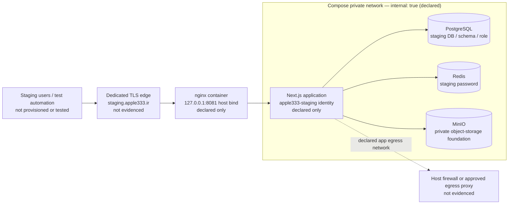

# Phase 05.1.1 — Module 01 Staging Validation Report

**Status:** **BLOCKED — scaffold verified; no staging environment activated**
**Audit date:** 2026-07-20
**Repository branch:** `feature/phase-05.1.1-production-evidence-completion`
**Source revision at audit:** `4003309 chore(deploy): harden phase 04.1 release safeguards`

## Scope and evidence boundary

This is a local, static audit of the checked-in staging assets. No Docker
command was started, no deployment or migration was attempted, and no network,
DNS, TLS, production host, production credential, database, Redis, or object
storage endpoint was accessed.

Consequently, a passing result below proves only the **configuration contract**;
it does not prove that a staging host, service, credential, firewall rule,
deployment, health endpoint, or public URL exists.

## Evidence collected

| Check | Observed result | Interpretation |
| --- | --- | --- |
| `node --version` using the local Codex runtime | `v24.14.0` | A local Node runtime was available solely to run the string-only verifier. |
| `node scripts/verify-staging-environment.mjs --template` | Passed | The staging template and `deploy/compose.staging.yml` satisfy the verifier's string rules. The command explicitly made no Docker, network, database, migration, or deployment action. |
| Workspace `deploy/.env.staging` and root `.env.staging` | Absent | There is no populated staging configuration in this workspace. This is correct for a repository, but it prevents runtime activation. |
| Docker / Docker Compose command resolution in the default local PowerShell environment | Not resolvable | No local Compose render, image build, container start, service health check, or log collection could be performed here. This does not establish the state of any remote host. |
| Checked-in deployment workflow | Present at `.github/workflows/deploy-staging.yml` | It is an unexecuted workflow definition; no run, self-hosted runner, GitHub environment approval, deployment log, or health result was available locally. |
| Closed deployment selector | `node scripts/verify-staging-environment.mjs --template`; focused `deploy-assets`/`staging-environment` tests | Source now maps only `production` to `compose.production.yml` and `staging` to `compose.staging.yml` after protected environment parsing. Arbitrary compose-file overrides and unknown environment values fail closed. |
| Phase 04.1 release gate | Explicitly blocked in `deploy/RELEASE-GATES.md` and `deploy/bin/lib.sh` | A fresh managed installation remains intentionally blocked; this audit found no authorized exception. |

The verifier ran in `--template` mode. That mode intentionally permits an
empty install ID and placeholder/empty secret fields, so its passing result
must not be read as validation of a real protected environment file.

## Intended staging topology (static design only)

`deploy/compose.staging.yml` declares PostgreSQL, Redis, MinIO, app, and
nginx. Its `private` network is marked `internal: true`; data services have no
published host ports; nginx alone is declared on the loopback staging port; and
volumes/networks/labels are namespaced by `COMPOSE_PROJECT_NAME`.

The application is also attached to a separate `egress` network. A Docker
network declaration cannot by itself prove that traffic to production is
blocked. A host firewall or approved egress proxy, with a reviewable deny rule
for production destinations, is still required to meet the "no production
network access" requirement.

## Non-secret environment-variable inventory

The following names are taken from `deploy/.env.staging.example`. Values are
not reproduced here. Sensitive values, credentials, URLs containing passwords,
and identifiers must remain in the protected external environment file, never
in Git or a report.

| Group | Variable names | Static contract |
| --- | --- | --- |
| Deployment identity and paths | `APPLE333_PROJECT_ID`, `APPLE333_ENVIRONMENT`, `COMPOSE_PROJECT_NAME`, `APPLE333_INSTALL_ROOT`, `APPLE333_STATE_DIR`, `APPLE333_BACKUP_DIR`, `APPLE333_INSTALL_ID` | Must identify the isolated staging deployment; the template's install ID is deliberately empty. |
| Listener and app runtime | `APPLE333_HTTP_BIND`, `APPLE333_HTTP_PORT`, `NODE_ENV`, `APP_NAME`, `APPLE333_APP_IMAGE` | The intended listener is loopback-only; the Next.js runtime remains production mode while the deployment identity is staging. |
| Public application origins | `APP_URL`, `AUTH_URL`, `NEXTAUTH_URL` | Each must resolve to the same HTTPS staging origin, never the production origin. |
| Authentication secrets (names only) | `AUTH_SECRET`, `NEXTAUTH_SECRET` | A distinct, high-entropy staging secret is required; current compatibility requires the two values to match. |
| PostgreSQL identity and connection (names only) | `POSTGRES_DB`, `POSTGRES_SCHEMA`, `POSTGRES_USER`, `POSTGRES_PASSWORD`, `DATABASE_URL` | Must identify the private Compose `postgres` service with a dedicated non-`public` schema. |
| Redis identity and connection (names only) | `REDIS_PASSWORD`, `REDIS_URL` | Must identify the authenticated private Compose `redis` service. |
| Object-storage foundation | `MINIO_ROOT_USER`, `MINIO_ROOT_PASSWORD`, `APPLE333_MINIO_IMAGE`, `S3_ENDPOINT`, `S3_REGION`, `S3_BUCKET`, `S3_ACCESS_KEY`, `S3_SECRET_KEY` | Values must be staging-specific. The current Compose asset does not create a bucket/user and does not activate an application S3 adapter. |
| Staging telemetry | `SENTRY_DSN`, `SENTRY_ENVIRONMENT`, `SENTRY_TRACES_SAMPLE_RATE` | Telemetry is optional, but any DSN/project must be staging-only. |

`METRICS_ENABLED`, `APPLE333_TRUST_PROXY_HEADERS`, and the application port are
Compose-defined constants, not entries in the staging environment template.

## Static service-identity assessment

| Identity / service | Static evidence | Runtime evidence | Result |
| --- | --- | --- | --- |
| Application | Staging app name, staging origin, staging image tag, app labels, `/api/ready` healthcheck, and loopback nginx bind are declared. | No image built; no container started; no readiness result; no TLS-edge check. | Not validated. |
| PostgreSQL | Dedicated Compose service, volume label, database/schema/user variables, and private `postgres:5432` URL contract are declared. | No database exists or was contacted; no `current_database`, role, schema, migration, ownership-marker, or health evidence. | Not validated. |
| Redis | Dedicated volume, password-required command, private `redis:6379` URL contract, and PING healthcheck are declared. | No Redis instance was started or contacted. | Not validated. |
| Object storage | Private MinIO service, dedicated volume, root-credential variables, and local healthcheck are declared. | No MinIO instance, bucket, user, storage adapter, or object operation was validated. | Not validated. |
| Network isolation | Private network is declared internal; data services have no host ports; nginx is loopback-bound. | No Docker network inspection, host firewall/proxy rule, external DNS/TLS, or production-deny test exists. | Not validated. |

There are **no service health results** and **no deployment logs** for this
module because starting services or running a deployment was outside its scope.

## Deployment-path selector remediation

The originally observed production-Compose hard-code is no longer present.
After the protected environment file has been parsed and validated,
`deploy/bin/lib.sh` now uses a closed source-controlled mapping:

| Managed environment | Selected file | Unsupported values / overrides |
| --- | --- | --- |
| `production` | `deploy/compose.production.yml` | Rejected |
| `staging` | `deploy/compose.staging.yml` | Rejected |

`COMPOSE_FILE` is not accepted from an environment variable or command-line
argument. The selector canonicalizes the selected path, confirms it remains
inside `deploy/`, and requires the file to exist. It runs after
`load_environment_file`, so a staging workflow that supplies a protected
staging environment selects the audited staging topology rather than merely
passing staging values to the production topology.

This source-level remediation was validated with the string-only staging
verifier and focused tests. It is **not** a Compose render or runtime proof.

The Phase 04.1 safeguard remains untouched: `install.sh` calls
`require_phase_04_1_pim_baseline_approval` before deployment mutation, and
`update.sh` calls it before the migration path's container start, image build,
or Prisma deployment. Phase 05.1.1 provides no staging exception, bypass flag,
or manual schema workaround.

## Remaining blockers before Module 01 can pass

1. Preserve the Phase 04.1 migration hard block. Provide a separately reviewed
   staging bootstrap/adoption decision before any fresh managed installation.
2. Provision an isolated Linux host/VM or equivalent account with Docker
   Compose v2, a clean dedicated checkout, a protected mode-`0600` external
   staging environment file, and no production credentials.
3. Configure the dedicated TLS edge and verified host firewall/proxy policy so
   the app's egress network cannot reach production services.
4. After authorization, collect real evidence: Compose render, labels and
   ownership preflight, PostgreSQL/Redis/MinIO identities, service health,
   `/api/ready`, TLS routing, deployment logs, and an explicit production-deny
   network test.

## Decision

Module 01 is **not approved**. The string-only staging scaffold passed, but the
required real staging evidence is absent. The static selector now targets the
audited staging Compose topology, but no production deployment, database
change, migration, or exception was made during this audit.
