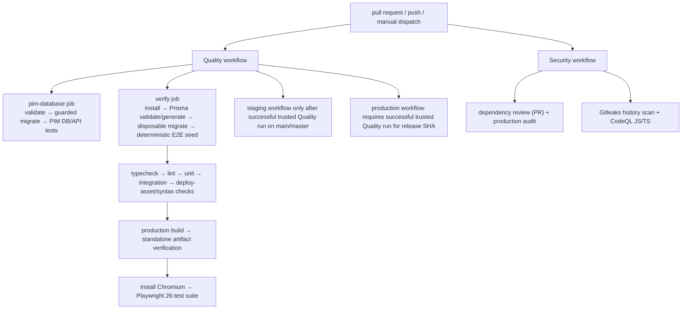

# Phase 05.1.1 — CI pipeline validation report

**Module:** 09 — CI pipeline verification
**Validation date:** 2026-07-20
**Validation mode:** local static review, focused local tests, and test discovery
**Repository snapshot:** `feature/phase-05.1.1-production-evidence-completion`; working tree is intentionally uncommitted
**Remote GitHub Actions evidence:** **not available in this validation**

## Scope and evidence boundary

This report validates the current working-tree definitions of the CI tooling. It
does not represent a GitHub Actions run: no workflow was dispatched, no
production or staging environment was contacted, no database was migrated, and
no remote log, run ID, artifact, or conclusion was retrieved.

The Quality and Security workflow definitions are uncommitted working-tree
changes. Consequently, GitHub Actions cannot yet provide immutable execution
evidence for this exact version. A successful run for the intentionally created
commit that contains these definitions is still required before Phase 05.1.1
can be approved.

## Static verification performed

| Check | Evidence | Result |
| --- | --- | --- |
| Workflow inventory | Read `.github/workflows/quality.yml`, `security.yml`, `pim-performance.yml`, `deploy-staging.yml`, and `deploy-production.yml`. | Pass — Quality and Security workflows exist; Integration and E2E are Quality steps, not separate workflows. |
| Workflow change hygiene | `git diff --check -- .github/workflows` completed without whitespace errors. | Pass |
| Runtime contract | `package.json` declares `pnpm@10.26.0` and Node `>=20.18.0`; CI explicitly installs pnpm 10.26.0 and Node 20. | Pass |
| Deterministic install | Both Quality jobs and the production dependency audit use `pnpm install --frozen-lockfile`. | Pass |
| Disposable application services | Quality `verify` defines PostgreSQL `apple333_test` and Redis services, both loopback-addressed by CI job environment variables. | Pass by source inspection only |
| Isolated PIM service | Quality `pim-database` defines a separate PostgreSQL service at `127.0.0.1:55432/apple333_pim_test`. | Pass by source inspection only |
| Database target guards | PIM preflight requires the isolated PIM target; E2E fixture validation requires `NODE_ENV=test`, `APPLE333_E2E_TEST_DB=1`, a loopback host, an allow-listed test database, and `schema=public`. | Pass by source inspection only |
| E2E discovery | `pnpm exec playwright test --list` reported **26 tests in 6 files**. It starts no app server and opens no database connection. | Pass |
| Workflow syntax execution | No GitHub runner, `actionlint`, or YAML parser was available/executed locally. | Not independently verified |
| Remote Actions results | No run IDs, logs, check conclusions, or artifacts were available locally, and no remote query/dispatch was performed. | Not verified |

### Playwright discovery evidence

The following read-only discovery command completed successfully:

```powershell
node .\node_modules\@playwright\test\cli.js test --list
```

It reported `Total: 26 tests in 6 files`, covering public route shells,
catalog/product/search, comparison, wishlist, cart, keyboard navigation,
accessibility, and admin-access boundaries. This is test **enumeration**, not
an E2E pass result.

The same current working tree also completed `pnpm exec playwright test --list`
and reported the same 26 tests in 6 files. This corrects an earlier local
module-directory reconciliation observation. It remains discovery only, not an
E2E pass.

## Expected workflow graph



The two Quality jobs have no `needs` relationship and can run in parallel.
Within the `verify` job, the application validation sequence is deliberately
ordered so that schema deployment and deterministic fixture seeding complete
before the build and Playwright server start.

## Quality workflow — expected repeatable execution

### `pim-database` job

1. Check out the source with persisted credentials disabled.
2. Install pinned pnpm 10.26.0 and Node 20.
3. Install the locked dependency tree.
4. Run Prisma validation and client generation.
5. Validate the dedicated PIM test target.
6. Apply reviewed PIM migrations only to its disposable service.
7. Run real PIM persistence and public API tests.

### `verify` job

1. Start disposable PostgreSQL 16 and Redis 7 services.
2. Check out the source, install pinned pnpm/Node, and install from the lockfile.
3. Run Prisma validation and client generation.
4. Run `prisma migrate deploy` against only `apple333_test`, then run
   `scripts/seed-e2e-storefront.mjs` under its explicit test-database guard.
5. Run `pnpm typecheck`, `pnpm lint`, unit tests, integration tests, deployment
   asset tests, shell syntax checks, and Node syntax checks.
6. Build the production application and verify the standalone server/static
   artifact.
7. Install Playwright Chromium with OS dependencies.
8. Run `pnpm test:e2e`. On the Ubuntu runner, Playwright selects the standalone
   server mode, waits for `127.0.0.1:3000`, and executes the discovered suite.
9. If a test fails, upload `playwright-report/` and `test-results/` for seven
   days.

## Security workflow — expected repeatable execution

`security.yml` supplies the separate Security coverage requested by this
module:

- Pull requests run GitHub's dependency-review action and fail on High severity.
- Pull requests, all branch pushes, weekly scheduled runs, and manual runs
  run the production dependency audit.
- The audit captures complete JSON, validates it with
  `scripts/verify-production-dependency-audit.mjs`, fails closed on malformed
  output or High/Critical findings, reports Moderate findings without
  suppression, and uploads the JSON artifact.
- Gitleaks checks complete repository history.
- CodeQL analyzes JavaScript and TypeScript and can write security events only.

Actions are pinned to immutable commit SHAs, checkout does not persist
credentials, and the workflow-level default permission is `contents: read`.

## Coverage status against Module 09

| Requested pipeline | Current source coverage | Static status |
| --- | --- | --- |
| Quality | `.github/workflows/quality.yml` runs on pull requests, all branch pushes, and manual dispatch. | Present |
| Integration | `verify` runs `NODE_ENV=test pnpm test:integration` after deterministic test data seeding. | Present as a Quality step |
| E2E | `verify` installs Chromium and runs `pnpm test:e2e`; 26 tests are currently discoverable. | Present as a Quality step; not executed remotely |
| Security | `.github/workflows/security.yml` runs dependency review/audit, Gitleaks, and CodeQL on pull requests, all branch pushes, schedule, and manual dispatch. | Present; not executed remotely |

## Gaps and risks found

1. **No remote execution evidence.** There is no successful Actions run tied to
   an immutable commit containing the current workflow and test definitions.
   This blocks a repeatability claim.
2. **Security is not a deployment gate.** Staging and production deployment
   workflows require a successful trusted Quality run for the release SHA, but
   do not also require a successful Security run. This is a policy gap, not a
   claim of a detected vulnerability.
3. **Security does not yet have remote evidence.** The workflow now triggers on
   feature-branch pushes, but this uncommitted revision has not run remotely.
4. **Evidence artifact coverage is incomplete.** Playwright retains screenshots
   and traces on failure and Quality uploads them on failure. It does not set a
   video retention policy or upload application/server logs, despite Phase
   05.1.1 requiring screenshots, videos, traces, and logs.
5. **Lighthouse is not a CI Quality step.** `scripts/run-lighthouse.mjs` now
   produces the required page/mode artifact shape, but the reviewed Quality
   workflow does not execute it or upload Lighthouse artifacts. It cannot
   provide the required staging Lighthouse evidence.
6. **PIM benchmark automation is not wired to this branch.**
   `pim-performance.yml` is limited to the historical Phase 04.1 branch or a
   manual dispatch. It does not automatically establish Phase 05.1.1 benchmark
   evidence.
7. **Static YAML review is not execution validation.** The local environment
   lacked a workflow-specific YAML/action linter, and no CI runner was started.

## Required evidence-completion cycle

Do not mark this module or Phase 05.1.1 approved yet. After the current
working-tree changes are intentionally committed, use the normal pull-request
or trusted branch workflow path to collect evidence without touching
production:

1. Obtain a successful **Quality** run for the immutable commit SHA and retain
   its run URL/ID, job conclusions, and Playwright artifacts.
2. Obtain a successful **Security** run for the same SHA through the
   feature-branch push or pull-request trigger and retain its job conclusions
   and production-audit artifact.
3. Confirm the `verify` job executed all 26 Playwright tests after the
   disposable PostgreSQL migration and guarded deterministic seed.
4. Add or execute the separate staging database, benchmark, Lighthouse, and
   accessibility evidence required by the other Phase 05.1.1 modules.
5. Decide whether the documented CI artifact and deployment-gate gaps require
   a later, separately reviewed workflow change. This cycle improves the
   Security trigger/audit artifact, but it does not change GitHub required
   checks or deployment-gate configuration.

## Decision

**Static CI design: conditionally acceptable.** It has a reproducible locked
runtime contract, disposable database services, explicit test-target guards,
and a complete 26-test E2E discovery result.

**Execution evidence: incomplete.** No GitHub Actions run was executed or
retrieved, so Quality, Integration, E2E, and Security cannot be recorded as
passing. The Phase 05.1.1 approval threshold is therefore **not met**.
