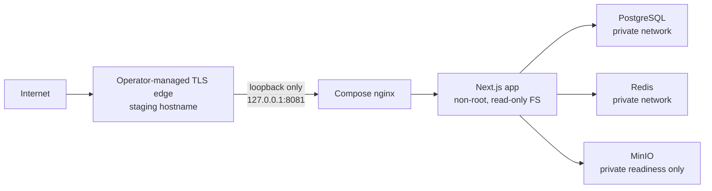

# Phase 05.1.2 — Staging Deployment Report

**Status:** BLOCKED — checked-in scaffolding is validated; no real staging environment, deployment, or runtime evidence was available to this audit.

**Scope:** Read-only audit of the checked-in staging Compose asset, deployment scripts, CI workflow, and related documentation. No production system, production credential, remote runner, database, Docker daemon, or deployment was accessed.

## Evidence classification

| Evidence | Result | What it proves | What it does not prove |
| --- | --- | --- | --- |
| `node scripts/verify-staging-environment.mjs --template` | Passed | The checked-in template, Compose isolation fragments, and closed environment-to-Compose selector satisfy the string-only verifier. | Docker rendering, host configuration, credentials, network, database, migrations, or service health. |
| `pnpm test:deploy` | Passed: 1 file, 11 tests | The focused deployment-asset assertions passed in this workspace. | A Linux host, Compose runtime, TLS edge, or GitHub Actions run. |
| `.github/workflows/deploy-staging.yml` review | Present | A guarded workflow definition exists. | That any runner, GitHub Environment policy, repository variable, or workflow run exists. |
| `deploy/.env.staging.example` and `deploy/compose.staging.yml` review | Present | A dedicated staging identity and service topology are described in source. | That a protected populated file exists or that its values are distinct from production. |

The repository contains no populated `deploy/.env.staging` file, no staging deployment log, no runtime `/api/ready` response, and no GitHub Actions artifact for this phase. Therefore none of those claims are made here.

## Checked-in topology (static fact)



Static values and controls in `deploy/.env.staging.example` and `deploy/compose.staging.yml`:

- Identity is fixed to `APPLE333_ENVIRONMENT=staging`, `COMPOSE_PROJECT_NAME=apple333-staging`, `/opt/apple333-staging`, and `127.0.0.1:8081`.
- PostgreSQL is scoped to `apple333_staging`, schema `apple333_staging`, and role `apple333_staging`; Redis uses the private Compose hostname. PostgreSQL, Redis, and MinIO publish no host ports.
- Only nginx publishes the loopback HTTP port. The app exposes port 3000 only inside the Compose networks.
- PostgreSQL, Redis, MinIO, and app have Compose health checks. `/api/ready` statically checks configuration, PostgreSQL, and Redis; it does **not** check object storage.
- App containers are non-root, read-only, capability-dropped, and use `no-new-privileges`; persistent resources have project/environment/install-ID labels.
- `deploy/bin/lib.sh` selects Compose through a closed mapping: `staging` selects `deploy/compose.staging.yml`; arbitrary Compose path overrides are rejected.

MinIO is not an activated application storage integration. In production mode, `src/server/storage/object-storage.ts` creates `UnconfiguredStorage`; the staging template itself says it neither creates buckets/users nor activates an S3 adapter.

## CI workflow assessment (static fact)

`deploy-staging.yml` is capable of updating an **already owned** staging deployment only under these workflow checks:

1. The release SHA comes from `main` or `master` and has a successful `Quality` workflow generated by a push. Manual dispatch performs the same branch/SHA quality check.
2. A self-hosted Linux x64 runner has the configured `STAGING_RUNNER_LABEL`.
3. `STAGING_DEPLOY_PATH`, `STAGING_ENV_FILE`, and `STAGING_HEALTHCHECK_URL` are non-empty repository variables.
4. The checkout is a clean, dedicated Git worktree; the external environment file resolves outside that worktree and has mode `0600`.
5. The workflow runs `bash deploy/bin/preflight.sh --assert-owned`, then `update.sh` with an explicit `skip` or `apply` migration choice, and finally calls the public health URL.

This is a good routine-release contract, but it is not a first-install workflow and it does not itself run benchmark, Lighthouse, accessibility, security-header, or full E2E evidence collection. The deployment workflow waits for **Quality**, not Security; repository branch protection may require Security, but that GitHub configuration is external and has not been evidenced.

## Exact blockers to real isolated staging

| ID | Blocker | Evidence | Required resolution |
| --- | --- | --- | --- |
| STG-01 | No authorized isolated host/runner/DNS/TLS/environment evidence exists. | No populated protected file, Actions run, Docker log, health response, or environment-policy export was supplied. | Infrastructure owner must provision and document a dedicated Linux runner/host, hostname, TLS edge, and `0600` protected environment file outside Git. |
| STG-02 | A fresh managed install is intentionally hard-blocked by the Phase 04.1 PIM release gate. | `deploy/bin/install.sh` and migration-bearing `update.sh` call `require_phase_04_1_pim_baseline_approval`; `deploy/RELEASE-GATES.md` says it applies to every managed server operation. | A later reviewed release must supply a release-specific, staging-safe bootstrap/adoption decision with target identity, schema fingerprint, reviewed SQL, backup/restore rehearsal, compatibility analysis, and recovery decision. Do not bypass the guard or use `db push`/reset. |
| STG-03 | The staging Compose file has no `migrate` service. | `compose.staging.yml` deliberately omits it; the verifier asserts that absence. `deploy/bin/lib.sh` runs migrations through `compose --profile migration ... migrate`. | The same reviewed bootstrap release must define and test an explicit staging migration execution model. Lifting the gate alone is insufficient. |
| STG-04 | The CI workflow assumes existing `OWNED_CURRENT` state. | It begins with `preflight.sh --assert-owned`, which a pristine target cannot satisfy. | Bootstrap staging through the future approved procedure first; only then enable routine workflow updates. |
| STG-05 | This feature branch cannot be deployed by the checked-in staging workflow. | Both trigger paths reject a source branch other than `main`/`master`. | Use an approved review/promotion path to a protected release branch; do not broaden the workflow trigger merely for this phase. |
| STG-06 | The brief's `STORAGE_URL` contract is not implemented. | The parser rejects unknown keys; it accepts `S3_ENDPOINT`/bucket/key fields instead. Runtime storage is deliberately unconfigured. | Record this as a requirements mismatch. Add a reviewed storage adapter and least-privilege bucket lifecycle before claiming application storage health. |
| STG-07 | TLS is an operator-owned edge concern, not a deployed Compose service. | Compose nginx is loopback HTTP only; `nginx.public-edge.conf.template` is optional and deliberately not installed. | A staging-only edge change must be reviewed and evidenced independently. |

## Authorized staging operator: evidence procedure

The following commands are for an authorized operator on a **new isolated staging host only**. They are listed to collect evidence; this audit did not run them. Never substitute a production hostname, checkout, Docker context, environment file, database, Redis target, bucket, or credential.

### 1. Record non-secret host and checkout identity

```bash
cd /opt/apple333-staging
git status --short
git rev-parse HEAD
docker info --format '{{.ServerVersion}}'
docker compose version
id
```

Expected evidence: clean checkout, immutable SHA, Docker Engine/Compose v2, and the designated staging deployment account. A general developer workstation or a runner with production access is not acceptable.

### 2. Validate the protected staging configuration without printing secrets

```bash
cd /opt/apple333-staging
export APPLE333_ENV_FILE=/etc/apple333/staging.env
test "$(stat -c '%a' "$APPLE333_ENV_FILE")" = 600
node scripts/verify-staging-environment.mjs \
  --env-file "$APPLE333_ENV_FILE" \
  --compose-file deploy/compose.staging.yml
bash deploy/bin/preflight.sh
docker compose --project-name apple333-staging \
  --env-file "$APPLE333_ENV_FILE" \
  -f deploy/compose.staging.yml config --quiet
```

`preflight.sh` is read-only. Stop on `FOREIGN`, `AMBIGUOUS`, `OWNED_OTHER_APPLE333`, `UNREACHABLE`, a used port, or any missing prerequisite. Do not use `install.sh --apply` while STG-02 and STG-03 remain unresolved.

### 3. After a future approved bootstrap, collect routine release evidence

Only after the target is demonstrably `OWNED_CURRENT` and a release authority has approved the exact migration decision:

```bash
cd /opt/apple333-staging
export APPLE333_ENV_FILE=/etc/apple333/staging.env
bash deploy/bin/preflight.sh --assert-owned
bash deploy/bin/status.sh
docker compose --project-name apple333-staging \
  --env-file "$APPLE333_ENV_FILE" \
  -f deploy/compose.staging.yml ps
docker compose --project-name apple333-staging \
  --env-file "$APPLE333_ENV_FILE" \
  -f deploy/compose.staging.yml logs --timestamps --tail=200 app postgres redis minio nginx
curl --fail --silent --show-error --dump-header - \
  http://127.0.0.1:8081/api/ready
curl --fail --silent --show-error --dump-header - \
  https://staging.apple333.ir/api/ready
```

Capture redacted output, workflow URL, commit SHA, migration decision, service status, and public readiness response in the phase evidence store. Do not include environment values, Authorization headers, cookies, or credentials.

### 4. Verify data-service liveness without exposing a data service publicly

```bash
docker compose --project-name apple333-staging \
  --env-file /etc/apple333/staging.env \
  -f deploy/compose.staging.yml exec -T postgres \
  pg_isready -U apple333_staging -d apple333_staging
docker compose --project-name apple333-staging \
  --env-file /etc/apple333/staging.env \
  -f deploy/compose.staging.yml exec -T redis \
  sh -ec 'redis-cli --no-auth-warning -a "$REDIS_PASSWORD" ping'
docker compose --project-name apple333-staging \
  --env-file /etc/apple333/staging.env \
  -f deploy/compose.staging.yml exec -T minio \
  curl --fail --silent http://127.0.0.1:9000/minio/health/live
```

These checks prove container/database/cache/object-store **liveness** only. They do not prove application media storage because no S3 adapter or bucket lifecycle is active.

## Required evidence before this report can change status

1. Redacted GitHub Environment policy and self-hosted runner isolation evidence.
2. An approved release-specific staging bootstrap/migration decision resolving STG-02 and STG-03.
3. A real workflow run URL for the immutable release SHA, with its job log and public HTTPS readiness result.
4. Docker service status and redacted health/log artifacts from the isolated host.
5. A separately attached storage decision: either explicitly out of scope for this phase, or an approved adapter/bucket/credential test plan.

Until then, this is deployment **scaffolding**, not real-environment validation.
