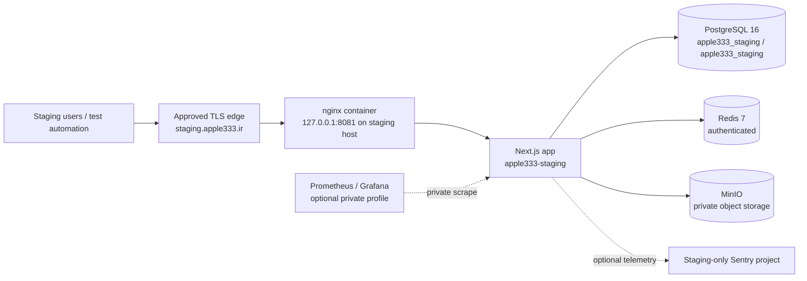

# Phase 05.1 — Staging environment design

## Status and scope

**Status:** design and source-configuration review only; no staging host, cloud
resource, secret, database, bucket, deployment, or migration was created by this
module.

This document defines the intended isolated non-production environment named
`apple333-staging`. It is based on the current Docker Compose deployment lane
in [`deploy/`](../../deploy/), the staging workflow, and its ownership-aware
scripts. It does not authorize a production deployment, a production database
connection, a migration bypass, or use of production credentials.

The current release deliberately blocks the Phase 04.1 initial PIM migration
for any managed server installation. Consequently, the design below is the
target staging topology, **not evidence that a new staging installation can
currently be bootstrapped**. The explicit gap is recorded below.

## 1. Target architecture



The currently reviewed Compose definition already contains these services:

| Service | Current Compose behavior | Staging requirement |
| --- | --- | --- |
| `app` | Non-root Next.js standalone container; readiness at `/api/ready`; private + egress networks | Build from the approved staging SHA only. It must have a staging-only URL, Auth secret, PostgreSQL URL, Redis URL, and telemetry configuration. |
| `postgres` | PostgreSQL 16 private Compose service with a named volume and health check | A distinct Compose volume, database, user, password, and non-`public` schema. No production dump or connection string. |
| `redis` | Password-protected private Redis service with AOF and health check | A distinct volume and password. Never attach the production Redis service or URL. |
| `minio` | Private MinIO service, not published to the host | A distinct volume and root credentials. At present it is infrastructure readiness only: the application still uses unconfigured storage until an S3 adapter is separately approved. |
| `nginx` | Internal reverse proxy, loopback-published only | Bind to a staging-only loopback port and put a separately reviewed TLS edge in front of it. Do not publish PostgreSQL, Redis, MinIO, Prometheus, or Grafana. |
| `prometheus` / `grafana` | Optional `observability` profile, private by default | Use separate staging credentials and retention. It is not an operational monitoring claim until dashboards and alert delivery are tested. |
| `migrate` | Short-lived Prisma image under the `migration` profile | Do not run it while the current Phase 04.1 release gate is blocked. Later use requires a reviewed staging bootstrap/adoption decision. |

The application, PostgreSQL, Redis, and MinIO data must stay inside the
`apple333-staging` Compose project. Compose labels, the state marker, and the
PostgreSQL `apple333_deployment_metadata` marker are the three ownership
signals required by the deployment scripts; a matching resource name alone is
not ownership evidence.

## 2. Isolation contract

The staging target is acceptable only if all of the following are true:

1. It uses a dedicated Linux host or an equivalently isolated VM/account. It
   must not share the production Docker daemon, Compose project, state
   directory, port, database, Redis instance, MinIO volume/bucket, or secret
   manager values.
2. Its checked-out repository is a clean dedicated path, for example
   `/opt/apple333-staging`; it is not `/opt/apple333` and not a developer's
   working tree.
3. Its protected configuration is outside Git, for example
   `/etc/apple333/staging.env`, owned by the staging deployment operator with
   mode `0600`. The workflow passes it through `APPLE333_ENV_FILE`; it must
   never be copied into the checkout, CI log, image layer, or test artifact.
4. All resources use `APPLE333_ENVIRONMENT=staging` and
   `COMPOSE_PROJECT_NAME=apple333-staging`. This produces names such as
   `apple333-staging_postgres_data` and `apple333-staging_private`, which do
   not overlap production's project resources.
5. The public origin is a dedicated HTTPS hostname such as
   `https://staging.apple333.ir`. It must not use `apple333.ir`, its production
   session cookies, or its authentication secret.
6. Test data is synthetic or explicitly approved non-production data. Do not
   restore production customer, order, identity, payment, or support data into
   staging.
7. The staging TLS edge may reach only the staging nginx loopback bind. It must
   not proxy to the production host or open a public route to internal services.

## 3. Staging configuration

The checked-in non-secret scaffolding is
[`deploy/.env.staging.example`](../../deploy/.env.staging.example),
[`deploy/compose.staging.yml`](../../deploy/compose.staging.yml), and the
string-only verifier [`scripts/verify-staging-environment.mjs`](../../scripts/verify-staging-environment.mjs).
It is a configuration contract, not evidence of a deployed staging target.

The current deployment library accepts one protected environment file through
`APPLE333_ENV_FILE` (otherwise it uses `deploy/.env.production`). The filename
is historical; when an external file is supplied, a staging file can safely use
the existing parser and Compose definition without changing repository files.

The following is a **value policy**, not a secret file to commit. Values shown
as angle-bracket references belong in the staging secret manager.

| Group | Required staging value / rule |
| --- | --- |
| Identity | `APPLE333_PROJECT_ID=apple333-enterprise-platform`; `APPLE333_ENVIRONMENT=staging`; `COMPOSE_PROJECT_NAME=apple333-staging`; `APPLE333_INSTALL_ROOT=/opt/apple333-staging`; `APPLE333_STATE_DIR=/var/lib/apple333-staging`; `APPLE333_BACKUP_DIR=/var/lib/apple333-staging/backups`. The first managed install generates its own `APPLE333_INSTALL_ID`; never copy production's ID. |
| Network | `APPLE333_HTTP_BIND=127.0.0.1`; choose an unused staging-only port such as `APPLE333_HTTP_PORT=8081`. The approved public edge terminates TLS and forwards only to that port. |
| Application / Auth | `NODE_ENV=production`; `APP_NAME=Apple333 Staging`; `APP_URL`, `AUTH_URL`, and `NEXTAUTH_URL` must all equal the staging HTTPS origin. `AUTH_SECRET` must be a new high-entropy staging secret; `NEXTAUTH_SECRET` must equal it for current compatibility. |
| PostgreSQL | Use distinct `POSTGRES_DB=apple333_staging`, `POSTGRES_SCHEMA=apple333_staging`, `POSTGRES_USER=apple333_staging`, and `POSTGRES_PASSWORD=<staging-secret>`. `DATABASE_URL` must point to the Compose hostname `postgres`, database `apple333_staging`, and schema `apple333_staging`. `public` is not allowed. |
| Redis | `REDIS_PASSWORD=<different-staging-secret>` and `REDIS_URL=redis://:<same-secret>@redis:6379`. The passwords must not equal production or PostgreSQL passwords. |
| Object storage | Set distinct `MINIO_ROOT_USER` and `MINIO_ROOT_PASSWORD`. If/when an approved S3 adapter is introduced, use a staging-only `S3_ENDPOINT`, `S3_BUCKET`, access key, and secret. Do not point to a production bucket; MinIO does not currently create buckets/users or activate application media storage automatically. |
| Observability | Use a staging-only Sentry DSN/project, `SENTRY_ENVIRONMENT=staging`, and a conservative sample rate. If observability is enabled, use distinct Grafana credentials, a loopback `GRAFANA_HTTP_PORT`, and staging retention. Never reuse production DSNs, alert routes, or Grafana credentials. |
| Backups | Configure a staging-specific age recipient, identity path, off-host destination, and retention policy. A staging backup destination must not overwrite or be treated as a production recovery copy. |

### Required keys accepted by the current deployment parser

The protected file must use plain `KEY=value` lines only; it is intentionally
not shell-sourced. It must contain the exact allowed key set where used. The
core required keys are:

```text
APPLE333_PROJECT_ID
APPLE333_ENVIRONMENT
COMPOSE_PROJECT_NAME
APPLE333_INSTALL_ROOT
APPLE333_STATE_DIR
APPLE333_BACKUP_DIR
APPLE333_INSTALL_ID
APPLE333_HTTP_BIND
APPLE333_HTTP_PORT
NODE_ENV
APP_NAME
APP_URL
AUTH_URL
NEXTAUTH_URL
AUTH_SECRET
NEXTAUTH_SECRET
POSTGRES_DB
POSTGRES_SCHEMA
POSTGRES_USER
POSTGRES_PASSWORD
DATABASE_URL
REDIS_PASSWORD
REDIS_URL
MINIO_ROOT_USER
MINIO_ROOT_PASSWORD
```

Optional keys accepted by the same parser are `APPLE333_MINIO_IMAGE`,
`PROMETHEUS_RETENTION_TIME`, `GRAFANA_HTTP_PORT`, `GRAFANA_ADMIN_USER`,
`GRAFANA_ADMIN_PASSWORD`, `SENTRY_DSN`, `SENTRY_ENVIRONMENT`,
`SENTRY_TRACES_SAMPLE_RATE`, `S3_ENDPOINT`, `S3_REGION`, `S3_BUCKET`,
`S3_ACCESS_KEY`, `S3_SECRET_KEY`, `APPLE333_BACKUP_AGE_RECIPIENT`,
`APPLE333_BACKUP_AGE_IDENTITY_FILE`, `APPLE333_BACKUP_OFFSITE_DIR`, and
`APPLE333_BACKUP_RETENTION_DAYS`.

Never put an actual value for any secret in Markdown, Git, shell history,
GitHub repository variables, or CI logs. GitHub variables may contain only
non-secret paths, runner labels, and URLs; secrets stay in the protected host
file or an approved environment-secret mechanism.

## 4. Deployment procedure

### A. Provision and verify the host (read-only / operator work)

1. Provision the isolated non-production host and Docker Compose v2 runtime.
   Give the staging deployment operator ownership of `/opt/apple333-staging`
   and `/var/lib/apple333-staging`; do not reuse production paths.
2. Configure a dedicated TLS hostname and a separate reviewed edge proxy. Keep
   the Compose nginx listener bound to `127.0.0.1:8081` (or another free
   staging-only loopback port).
3. Create the protected external configuration file from the *shape* of
   `deploy/.env.production.example`, changing every identity, path, URL, and
   secret according to the table above. Set mode `0600`.
4. Clone a clean dedicated checkout, fetch the approved immutable release SHA,
   and make sure `git status --porcelain` is empty. The GitHub workflow rejects
   a dirty deployment checkout.
5. Run only the read-only ownership preflight:

   ```bash
   cd /opt/apple333-staging
   export APPLE333_ENV_FILE=/etc/apple333/staging.env
   bash deploy/bin/preflight.sh
   ```

   Review the reported environment, Compose project, state path, labelled
   resource classification, database/schema evidence, and port availability.
   If any resource is foreign or ambiguous, stop. Do not rename, delete,
   overwrite, or adopt it merely to make the command pass.

### B. Bootstrap status — currently blocked

Do **not** run `deploy/bin/install.sh --apply` to force a new environment with
this release. The command intentionally requires the Phase 04.1 PIM migration
bundle and then hard-blocks it. That guard applies to staging as well as
production. The correct result today is a safe stop, not a partial database or
manual `prisma db push` workaround.

Bootstrap may occur only after a later reviewed release provides a
staging-specific migration/bootstrap approval that meets the release-gate
evidence: target identity and schema fingerprint, reviewed SQL, backup and
restore rehearsal, compatibility analysis, and a documented recovery decision.
At that time the exact approved runbook may authorize:

```bash
# Illustration only; blocked by the current release gate.
export APPLE333_ENV_FILE=/etc/apple333/staging.env
bash deploy/bin/install.sh --apply
```

The installer will then create the staging install identifier, labelled
volumes/networks, database marker, and application containers only after its
fresh-install ownership assertions pass.

### C. Routine deployment after a verified staging installation exists

The repository already has `.github/workflows/deploy-staging.yml`. It permits
deployment only after a successful trusted `Quality` workflow from `main` or
`master`, and checks out the exact immutable SHA on the self-hosted staging
runner. Configure these non-secret GitHub repository variables before enabling
it:

```text
STAGING_RUNNER_LABEL=<dedicated-staging-runner-label>
STAGING_DEPLOY_PATH=/opt/apple333-staging
STAGING_ENV_FILE=/etc/apple333/staging.env
STAGING_HEALTHCHECK_URL=https://staging.apple333.ir/api/ready
```

The staging environment itself should require protected-environment review in
GitHub. The workflow asserts that the external environment file exists,
resolves outside the checkout, is mode `0600`, and that the checkout is clean.
It runs the ownership-aware preflight, then an explicit migration choice. For
a reviewed release with no schema change, the permitted release operation is:

```bash
export APPLE333_ENV_FILE=/etc/apple333/staging.env
bash deploy/bin/preflight.sh --assert-owned
bash deploy/bin/update.sh --apply --skip-migrations
```

Use `--apply-migrations` only when the exact release has cleared its migration
gate and its staging change plan has been reviewed. It must not be selected as
a convenience for the blocked Phase 04.1 baseline.

### D. Post-deployment evidence

After a future approved deployment, collect non-secret evidence that:

1. `bash deploy/bin/status.sh` reports only `OWNED_CURRENT` resource evidence;
2. the private app health check and the public staging `/api/ready` endpoint
   succeed;
3. the TLS edge points only to the staging loopback port;
4. PostgreSQL, Redis, and MinIO all have staging-specific labels/volumes and
   no published data-service ports;
5. test automation uses staging URLs and synthetic data; and
6. the required Phase 05.1 E2E, Lighthouse, database benchmark,
   accessibility, security, and dependency reports are attached to the release
   decision.

## 5. Existing safeguards that must remain enabled

- The Compose project keeps PostgreSQL, Redis, MinIO, and app traffic on
  private networks; only nginx is loopback-published.
- The app and migrator run non-root, with read-only root filesystems,
  `no-new-privileges`, dropped capabilities, resource limits, and health
  checks.
- Deployment scripts use labels plus a state marker and a PostgreSQL marker to
  prove ownership. Unknown resources are stopped for investigation, not
  reused.
- Update commands require an explicit migration decision. They make no
  automatic database rollback and prohibit `prisma db push`, reset, blanket
  Docker pruning, and automatic deletion.
- `/api/metrics` is not exposed through nginx; optional Prometheus connects on
  the private network.

## 6. Concrete implementation gaps and required follow-up

| Priority | Gap | Required action before relying on staging |
| --- | --- | --- |
| Blocker | A fresh managed staging install is hard-blocked by the Phase 04.1 PIM migration release gate. | Deliver a separately reviewed staging bootstrap/adoption release with the evidence required by `deploy/RELEASE-GATES.md`. Do not bypass the guard or run manual schema commands. |
| Blocker | No live staging host, DNS/TLS edge, protected external environment file, or clean self-hosted runner has been evidenced in this repository. | Provision and independently verify the isolated host, DNS, TLS, least-privilege runner, and secret handling before deployment. |
| Complete (scaffold only) | A dedicated `deploy/.env.staging.example`, `deploy/compose.staging.yml`, and string-only verifier now exist. | Copy the template to a protected external staging file, replace placeholders through the secret manager, and run the verifier before any Docker action. This does not authorize deployment. |
| High | Staging workflow is wired to successful `Quality` runs on `main`/`master`, but it assumes an already owned deployment. | Configure the four `STAGING_*` repository variables and GitHub `staging` environment protection; keep it disabled until bootstrap has valid ownership state. |
| High | MinIO is only infrastructure readiness. It does not create a bucket/user and the application storage adapter is not activated. | Define an approved staging bucket lifecycle, least-privilege service credentials, retention/cleanup policy, and S3 adapter integration before testing user media. |
| Medium | Staging data generation, 10k/100k benchmark seed, cleanup, and PII controls are not implemented by this module. | Complete Phase 05.1 benchmark-data work with deterministic synthetic data and an explicit reset/retention policy that never touches production data. |
| Medium | Alert routes, Grafana dashboards, Sentry project/DSN, and backup/restore evidence are not provisioned merely by Compose. | Configure staging-only observability and backup destinations, test delivery and an isolated restore drill, then record evidence. |
| Medium | The current workflow's automatic trigger is limited to `main`/`master`. | Decide and document the reviewed promotion path from feature branch to protected release branch; do not broaden the trigger without release-authority review. |

## 7. Acceptance criteria for this module

This Module 02 documentation is complete when reviewed. The actual staging
environment is **not** accepted until every blocker above is resolved and the
post-deployment evidence exists. Until then, Phase 05.1 must continue as a
validation effort only and must not claim production-like staging availability.
