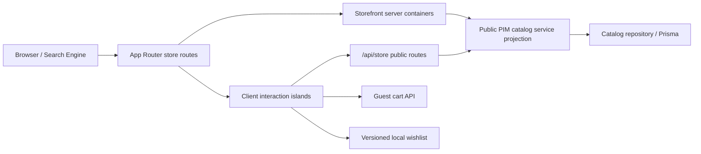

# Phase 05 — Storefront Target Architecture

**Status:** Proposed implementation architecture.
**Date:** 2026-07-20
**Design principle:** Preserve approved storefront UI, consume the existing Phase 04 public PIM projection, and add no mock data, schema change, production access, payment flow, or order flow.

## 1. Architecture objectives

- Build a premium, Apple-focused public storefront that is fast, mobile-first, accessible, and search-engine friendly.
- Keep product/catalog truth in Phase 04 PIM; do not copy product data into a new storefront model.
- Render indexable primary content on the server with documented revalidation, while retaining client islands for interaction.
- Make URLs the source of truth for catalog discovery state.
- Keep basket behavior guest-safe and prepare, but do not implement, authenticated wishlist/account synchronization.
- Keep the implementation feature-first without forcing a wholesale rewrite of existing components.

## 2. Proposed directory boundary

```text
src/features/storefront/
├── components/       # Storefront-specific presentational additions and JSON-LD
├── containers/       # Server composition and page-level orchestration
├── hooks/            # Client-only interaction hooks (for example guest wishlist)
├── services/         # PIM query adapters, search normalization, metadata helpers
├── queries/          # Query keys and client query options
├── schemas/          # Zod schemas for URL/client boundary inputs
└── types/            # Storefront view and integration types
```

The directory is an incremental façade, not a parallel commerce system. Existing approved components under `src/components/store` remain reusable presentation building blocks during the migration. Existing public catalog DTOs in `src/modules/catalog/types.ts` remain the domain contract.

## 3. Data-flow design



### 3.1 Public PIM boundary

Browser-side interactions must use the canonical `/api/store/*` endpoints. Server containers may call the existing public catalog service only when they receive the same public PIM projection as the API; they must not query administrative models, reuse admin DTOs, or introduce write paths. This avoids an HTTP loop during server rendering while preserving one public-data contract.

All product, price, media, category, availability, and comparison values shown in Phase 05 originate in the existing public PIM contract. No hard-coded product, review, rating, price, stock, or promotional data is permitted.

### 3.2 Rendering strategy

| Page type | Initial render | Client behavior | Cache plan |
| --- | --- | --- | --- |
| Home | Server-composed PIM collections | Carousel/controls and client refinements only | Short ISR revalidation (initially 60 seconds; measure and tune). |
| Catalog | Server-composed initial page from URL state | Filter drawer, pagination, sorting, query updates | URL keyed; revalidated public catalog response. |
| Product detail | Server-composed product detail | Variant selection, gallery, add-to-cart/wishlist, comparison | Short ISR with metadata based on the same product projection. |
| Compare | Server initial selection where valid | Change selection and compare interaction | Public API for selection changes; handle missing results. |
| Cart / wishlist | Client interactive | Guest state and PIM lookups | Private/client state; no shared personalized cache. |

Server composition must preserve a clear loading and error path and avoid hiding PIM outages behind invented fallback products.

## 4. Route and URL strategy

| Need | Canonical route / state | Reason |
| --- | --- | --- |
| Home | `/` | Public storefront entry point. |
| Catalog | `/products` | Canonical indexable catalog listing. |
| Category filtering | `/products?category=<slug>` | Coexists safely with product detail URLs and retains URL state. |
| Product | `/products/[slug]` | Existing approved product-detail route. |
| Compare | `/compare?slugs=<slug>,<slug>` | Shareable two-to-four product comparison state. |
| Search | `/search?q=<query>` or `/products?query=<query>` | Must validate/normalize query input; choose one canonical URL during implementation. |
| Guest wishlist | `/wishlist` | Device-local wishlist, explicitly not an account-synced list. |
| Account preparation | `/account` | Public/authentication-aware shell only; no customer profile or order feature in Phase 05. |

### Dynamic route collision rule

Do **not** create `/products/[category]` alongside `/products/[slug]`. Next.js App Router treats both as the same dynamic pathname and rejects the sibling routes. If category landing pages are approved, use `/categories/[category]`; otherwise keep the canonical `category` query parameter on `/products`.

## 5. Catalog and search design

### 5.1 URL schema

The storefront schema should parse and normalize only supported public catalog inputs:

- `query`
- `category`
- `color`
- `storage`
- `minPriceRials` / `maxPriceRials`
- `inStock`
- `collection`
- `sort`
- `page` / `pageSize`

Use Zod at route/client boundary crossings. Invalid state must be replaced with a safe canonical state or reported as a user-facing validation error; it must never become a raw database query.

### 5.2 Persian-search adapter

Phase 05 should establish a swappable search adapter with:

- Unicode normalization;
- Persian/Arabic character normalization (for example `ي`/`ی`, `ك`/`ک`);
- whitespace cleanup;
- a controlled synonym-expansion interface;
- an explicit capability flag for full-text, typo tolerance, and ranking.

The current public PIM query is an interim text-match capability. It does not prove indexed full-text search or typo tolerance. The UI and documentation must state that limitation until a separately approved search-index implementation is available.

### 5.3 Filter and sort integrity

The UI may expose only filters supported by the public PIM contract. Phase 05 adds reviewed, bounded `brand` and `model` query predicates alongside category, color, storage, price, and availability; future facets still require a separately reviewed PIM/API enhancement. Price-sort output must be described carefully because current service behavior applies price sorting after database pagination; no interface may claim a globally ordered price result until that is resolved at the PIM layer.

## 6. Wishlist and account boundary

### Guest wishlist

The Phase 05 wishlist is deliberately device-local:

- Store only validated product slugs in versioned `localStorage`.
- Hydrate only on the client to avoid an SSR mismatch.
- Fetch displayed products from the real public PIM API; do not store product copies in local storage.
- Provide add, remove, clear, and unavailable-product states.
- Clearly label it as local to the browser/device.

### Future authenticated synchronization

Define a small port/interface for an authenticated wishlist repository, but do not create tables, migrations, APIs, or customer writes in Phase 05. That work belongs to a later approved account/auth phase.

The account route may expose a secure preparation surface and authentication-aware navigation. It must not imply that addresses, orders, payments, or customer profile persistence exist if those flows are unavailable.

## 7. SEO and structured data

### Metadata

Each server route should use the same public PIM data for `generateMetadata` and page rendering:

- unique title and description;
- canonical URL where valid;
- product/category Open Graph and Twitter metadata;
- `noindex` when the public PIM SEO projection requires it;
- meaningful image alt text sourced from PIM media metadata.

### JSON-LD

Product pages may emit truthful `Product`, `Offer`, and `BreadcrumbList` schema using PIM data. `availability`, price, currency, image, and canonical identifiers must be derived from the public projection. Do not emit `Review` or aggregate-rating structured data until a validated review source and moderation policy exist.

### Sitemap and robots

`robots.ts` and `sitemap.ts` should include only indexable public routes. Product/category entries must be built from published public PIM records, not from admin entities or cached mock lists. Administrative, account, and API paths remain disallowed. The implementation must define a bounded, monitored enumeration strategy before attempting large-catalog sitemap generation.

## 8. Accessibility and interaction architecture

- Use semantic landmarks, headings, buttons, forms, labels, and native controls first.
- Add a visible-on-focus skip link to the main content.
- Make all header, drawer, filter, gallery, compare, cart, and wishlist actions keyboard reachable.
- When a dialog/drawer is used, trap focus, expose an accessible name, restore focus on close, and support Escape.
- Announce asynchronous cart/wishlist/filter updates with an appropriate live region.
- Preserve RTL layout correctness and readable Persian typography.
- Test mobile breakpoints and touch target sizing in E2E/browser checks.

## 9. Security architecture

- Keep the existing Zod validation and rate limiting on `/api/store/*` routes.
- Keep cart operations same-origin and private-cache controlled.
- Encode route params and query values before constructing client URLs.
- Never expose admin PIM fields, database errors, secrets, or stack traces in public pages.
- Do not add unsafe HTML rendering for PIM descriptions/specifications. Any future rich-text rendering requires a reviewed sanitizer policy.
- Treat local wishlist storage as untrusted input and validate every slug before use.

## 10. Performance architecture

- Server-render principal catalog/product content and use a measured ISR policy.
- Use responsive `next/image` configuration, meaningful `sizes`, controlled priority only for above-the-fold media, and lazy loading for noncritical gallery/media.
- Keep client components narrow; load gallery, compare, filters, wishlist, and cart interaction code only where needed.
- Avoid shipping full product lists to the client when a paginated public PIM response suffices.
- Define bundle and Lighthouse budgets, then record reproducible measured results. Targets are acceptance criteria, not assumptions.

## 11. Test architecture

| Layer | Primary responsibility |
| --- | --- |
| Unit | URL schema, Persian normalization, price formatting, wishlist reducer/storage guards, metadata/JSON-LD constructors, query builders. |
| Integration | Public PIM API response adaptation, category payload regression, catalog route state, error/missing product handling, SEO response behavior. |
| E2E | Home → catalog → product → comparison, filter/search URL behavior, guest wishlist, guest cart, keyboard/mobile smoke flows. |

Tests must use deterministic fixtures/mocks only at the test boundary. Application UI must remain dependent on the real PIM contracts in production code. Test counts and Lighthouse scores must be reported from actual command output; they may not be asserted as complete in architecture documentation.

## 12. Deliberate Phase 05 exclusions

This architecture does not authorize:

- checkout payment, order creation, refunds, or invoices;
- inventory reservations or branch-stock mutations;
- installments, trade-in, valuations, CRM, accounting, or ERP;
- customer profile/address persistence;
- database migrations or destructive database operations;
- production deployment or production database access;
- a new search-engine deployment without a separate technical decision and approval.

## 13. Completion criteria

Phase 05 can be considered for completion only after the agreed storefront features are implemented, quality gates have been run, accessibility/security/performance findings are documented, and the final report states measured results and outstanding limitations. This target architecture alone is not an implementation-completion certificate.
