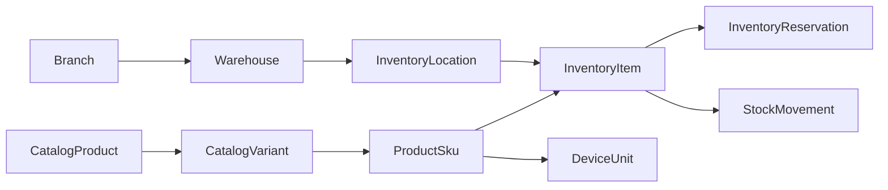

# Phase 06 — Inventory Domain Design

**Status:** Design approved for implementation; no production data, database, or deployment has been touched.

## Purpose and boundary

Phase 06 establishes the operational inventory foundation for four physical
Apple333 stores. It owns physical stock, stock state, warehouse placement,
device identity, and temporary inventory holds. It does **not** implement
orders, payment, checkout, installment contracts, accounting entries, or ERP
integration.

The canonical commercial identity remains the existing PIM chain:

`ProductSku.id` is the only inventory foreign key for a sellable item.
`CatalogVariant.sku` is not used as an inventory key because its equality with
`ProductSku.code` is an application convention, not a database constraint.
Public API lookups by SKU resolve `ProductSku.code` server-side.

## Existing baseline to preserve

The repository already has canonical `Branch` and `BranchInventory` models.
`BranchInventory` is a live branch/variant availability projection consumed by
the storefront, cart validation, PIM archive guard, fixtures, and tests. Phase
06 must not replace, rename, or delete either model. It introduces a
warehouse-level canonical ledger and retains `BranchInventory` as a
read-compatible projection until a separately evidenced reconciliation and
cutover are approved.

No operational branch, warehouse, device, or stock row is fabricated by this
phase. The four physical branches are created only through controlled admin
operations or explicit isolated-test fixtures.

## Domain concepts

| Concept | Responsibility | Identity / ownership |
| --- | --- | --- |
| Branch | A retail store or central stock node. | Existing `Branch`; one branch owns zero or more warehouses. |
| Warehouse | A physical or logical stock-holding facility under one branch. | `(branchId, code)` is unique. |
| InventoryLocation | A controlled area within a warehouse: receiving, storage, pickup, quarantine, or damaged. | `(warehouseId, code)` is unique. |
| InventoryItem | Canonical balance for one SKU in one location. | `(locationId, skuId)` is unique. |
| StockMovement | Immutable record of a received, transferred, adjusted, returned, or reserved quantity. | Append-only; every balance mutation has a movement. |
| DeviceUnit | A tracked physical Apple device or serialized item. | Global normalized IMEI and serial number uniqueness. |
| InventoryReservation | A temporary hold against one canonical inventory item. | Opaque reference and expiry; it has no order or payment relation. |
| InventoryAdjustment | A governed movement of type `ADJUSTMENT` with a reason and direction. | It is a domain operation, not a competing balance table. |

## Aggregate ownership and lifecycle

`Warehouse` is the operational aggregate boundary for stock operations. A
service resolves the warehouse and branch before applying a change. A location
can never be paired with an unrelated warehouse. A device’s branch is derived
through `DeviceUnit → InventoryItem → InventoryLocation → Warehouse → Branch`;
it is deliberately not stored redundantly on `DeviceUnit`.

### Statuses

- Branch and warehouse: `ACTIVE`, `DISABLED`, or `ARCHIVED`.
- Location: active, disabled, or archived plus a type of `RECEIVING`,
  `STORAGE`, `PICKUP`, `QUARANTINE`, or `DAMAGED`.
- Device unit: `AVAILABLE`, `RESERVED`, `SOLD`, `RETURNED`, or `DAMAGED`.
- Reservation: `ACTIVE`, `RELEASED`, `EXPIRED`, `CANCELLED`, or `FULFILLED`.

Disabling stops new movements and public pickup visibility. It never erases
historical movements, devices, or audit evidence.

## Stock invariants

Every mutation is a single Prisma transaction with an idempotency/correlation
key and an optimistic version condition. Repository methods expose queries and
transaction primitives only; they do not expose a direct arbitrary quantity
update.

1. `quantity >= 0`
2. `reservedQuantity >= 0`
3. `reservedQuantity <= quantity`
4. `availableQuantity = quantity - reservedQuantity`
5. A movement quantity is strictly positive.
6. A transfer creates a paired source/destination effect atomically.
7. A reservation changes reserved quantity and records `SALE_RESERVED`; release
   or expiry reverses the reserved quantity atomically.
8. A transfer, adjustment, receive, or device-state transition cannot be
   repeated with the same idempotency key.
9. New history relations use restrictive deletion semantics. Archiving a PIM
   variant with inventory history must be blocked.

The database migration will contain PostgreSQL `CHECK` constraints for the
numeric invariants. The application additionally validates all transitions and
authorization rules before a transaction begins.

## Movement model

| Type | Source | Destination | Effect |
| --- | --- | --- | --- |
| `PURCHASE` | None | Receiving/storage location | Increases on-hand stock. |
| `TRANSFER` | One location | Another location | Atomically decreases then increases the same SKU. |
| `ADJUSTMENT` | Optional | Optional | Requires direction and a governed reason. |
| `RETURN` | Optional | Quarantine/receiving location | Returns tracked or untracked stock under an explicit reference. |
| `SALE_RESERVED` | Available balance | Same item reservation balance | Creates a temporary hold only; no order or payment occurs. |

`StockMovement` is immutable. Corrections are compensating movements; they are
not edits or deletes to historical rows.

## Device and IMEI policy

IMEI is stored as text to preserve leading zeroes. The service normalizes
formatting before persistence and rejects a duplicate normalized IMEI. A device
unit must have at least an IMEI or a serial number, and both values are never
included in public storefront DTOs or raw audit metadata. Detailed rules are in
[03-imei-design.md](03-imei-design.md).

## Branch visibility and storefront availability

The public storefront receives only branch name/city/pickup eligibility and an
availability band. It never receives device identifiers, location names,
movement history, or internal audit data.

The availability service derives branch stock from committed canonical balances
and maps it to:

- `AVAILABLE` — stock is available above the configured limited threshold.
- `LIMITED` — stock is positive but at or below that threshold.
- `UNAVAILABLE` — no available stock or the branch/pickup path is disabled.

The existing public exact quantity contract is a compatibility decision that
must be reviewed before it changes. Since public catalog data is cached, a
committed inventory mutation must explicitly invalidate/revalidate the affected
SKU/product availability; a 60-second stale cache is not an acceptable stock
write acknowledgement.

## Reservation foundation

Reservations have an opaque `reference`, expiry timestamp, creator, status,
quantity, and idempotency key. For a tracked SKU, the reservation also owns
the exact selected `DeviceUnit` rows while it is active; release returns those
units to `AVAILABLE` in the same transaction. They are intentionally not
linked to an order, payment, installment contract, or accounting entry. Future
phases may supply an additional typed reference without changing the stock
invariant.

## Authorization and audit boundary

The existing `withAdminRoute`, Zod parsing, same-origin mutation protection,
rate limiting, request ID, `requireBranchAccess`, `AuditLog`, and transactional
audit helper are reused. New granular permissions cover branch/warehouse
management, inventory receipt/adjustment/transfer/reservation, and device-unit
access. A branch-scoped actor is checked inside the inventory service after the
actual resource branch is resolved; UI visibility is not authorization.

Audit metadata records action, reason, reference, correlation ID, and
redacted before/after balance snapshots. IMEI and serial number are never
stored unredacted in `AuditLog.metadata` because the generic JSON sanitizer has
no identifier-specific redaction today.

## Explicit non-goals

- Sales order allocation, checkout, payment, invoice, accounting, and ERP.
- Automatic production branch/warehouse creation or stock seeding.
- PIM product, variant, SKU, category, or pricing duplication.
- Automatic migration against production, staging, shared, unknown, or
  pre-existing databases.
