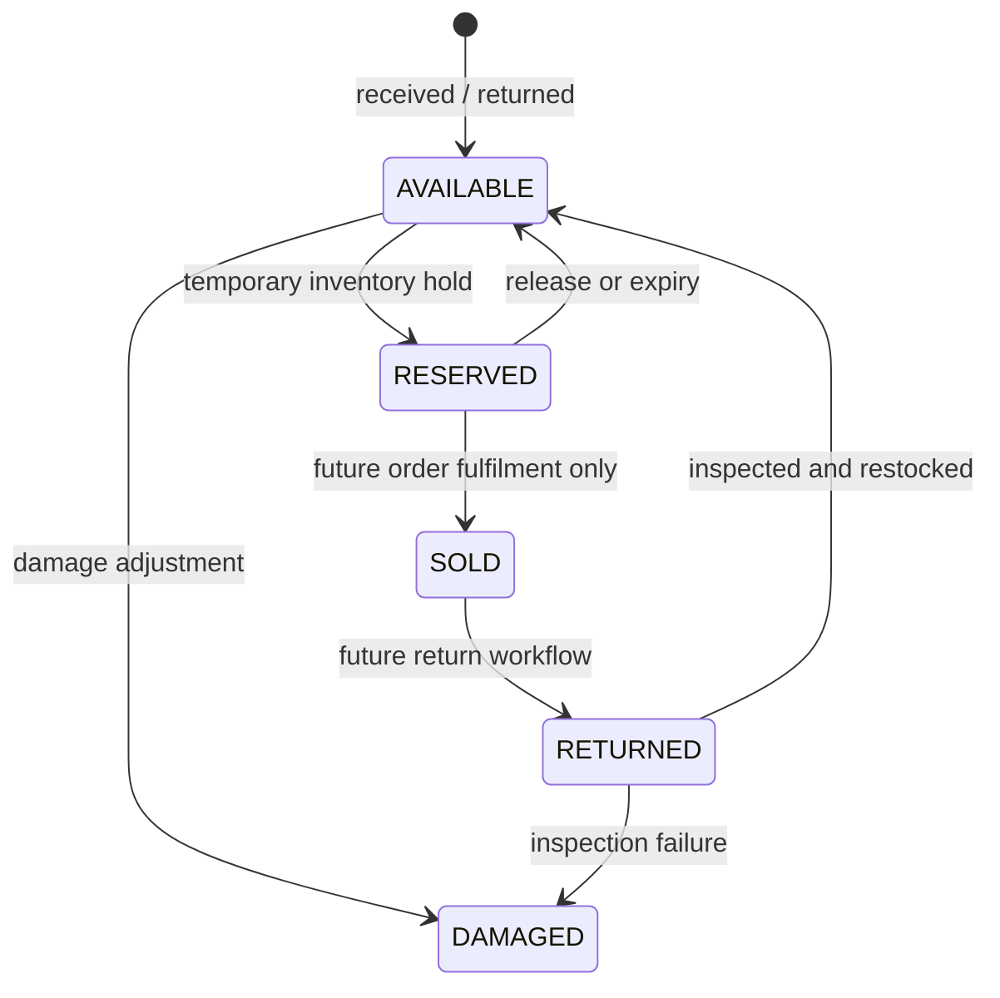

# Phase 06 — Device Unit, Serial, and IMEI Design

**Status:** Design baseline. No device identifiers, customer data, or real
inventory data were accessed during this work.

## Scope

Apple devices require traceability without exposing sensitive device identifiers
to the storefront. `DeviceUnit` represents an individual physical unit and is
linked to the canonical `ProductSku` inventory identity. It may optionally be
associated with its current canonical `InventoryItem`; branch ownership is
derived through the location and warehouse relationship rather than duplicated.

## Identifier policy

| Field | Storage rule | Validation rule |
| --- | --- | --- |
| IMEI | Text, preserving leading zeroes; stored normalized. | Strip accepted presentation separators, reject non-digits, require a supported 14/15-digit value, validate Luhn for a 15-digit value, and reject a global duplicate. |
| Serial number | Text, trimmed and normalized to the approved case/character policy. | Required when IMEI is absent; reject an empty or duplicate normalized serial. |
| SKU | `ProductSku.id` foreign key. | Must be active for receiving; history may reference a discontinued SKU. |
| Warranty date | Nullable date/time. | May be set only by an authorized inventory workflow. |

Database checks enforce that a device has at least one identifier. Nullable
unique columns allow serial-only or IMEI-only unit types while preserving
global uniqueness when a value exists.

## Device lifecycle

Phase 06 creates the state foundation only. `SOLD` and full return fulfilment
are reserved for later order/after-sales workflows. No checkout, payment, or
sales order relation is introduced here.

## Authorization and privacy

- Device detail/list/search APIs require the dedicated device read/manage
  permission plus resolved branch access.
- Public product, cart, compare, and availability APIs never select or expose
  IMEI, serial, warranty detail, movement reference, or location metadata.
- Admin list responses mask device identifiers by default. A detail view may
  show a full identifier only to an authorized actor and only when operationally
  necessary.
- The inventory dashboard provides a dedicated one-device receipt action for
  an IMEI and/or serial number. It posts directly to the protected receive
  endpoint; the identifier is not echoed into the dashboard table or audit
  metadata.
- Audit records use a keyed hash or redacted suffix/prefix representation;
  never raw IMEI or serial values in `AuditLog.metadata`.
- Search input is normalized and bounded. Error messages never disclose
  whether an identifier belongs to a different branch or customer.

## Integrity and movement linkage

Receiving a tracked device, moving it between locations, reserving it, and
releasing it occur in the same transaction as the related stock
movement/balance transition. A tracked transfer or reservation must submit one
unique device-unit ID per quantity; the service atomically changes the exact
unit's `inventoryItemId` or `reservationId`/status. Generic adjustment is
deliberately rejected for tracked SKUs until a later inspected-device damage or
return workflow can supply explicit unit state. A device cannot become
`AVAILABLE` if its inventory item has no available capacity. Duplicate
idempotency keys do not create a second device or a second movement.

IMEI uniqueness is validated in the service for useful errors and enforced by a
database unique constraint for concurrency safety. A duplicate-key race becomes
a conflict response, never a silent overwrite.

## Testing requirements

Phase 06 tests must cover:

1. IMEI normalization, invalid length, non-digit rejection, and Luhn failure.
2. Serial-only, IMEI-only, and dual-identifier units.
3. Duplicate identifier rejection across branches and warehouses.
4. Authorized versus denied device access and branch scoping.
5. Status transitions, damage handling, reservation/release behavior, and
   stock/movement atomicity.
6. Public DTO and cache tests proving identifiers are never leaked.
